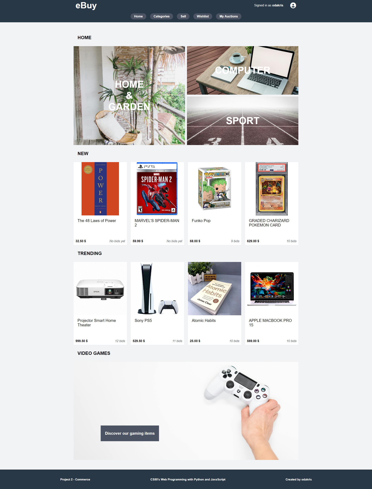
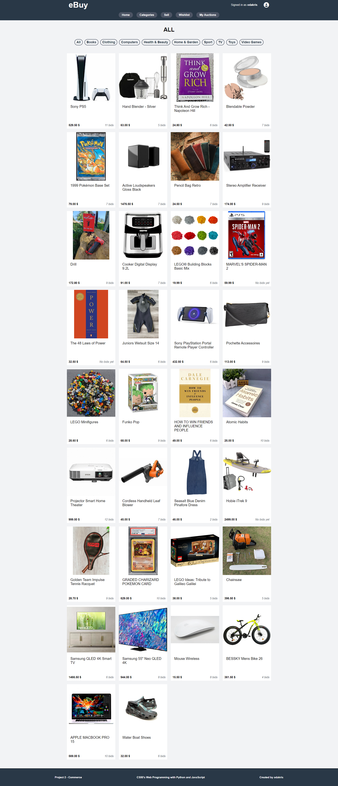
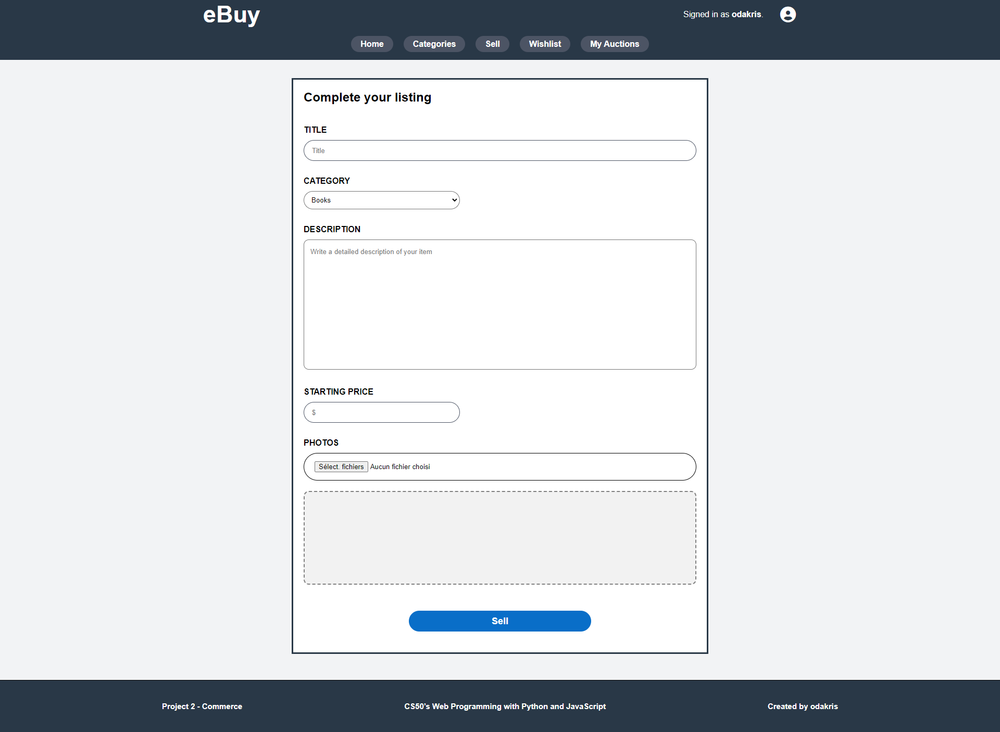
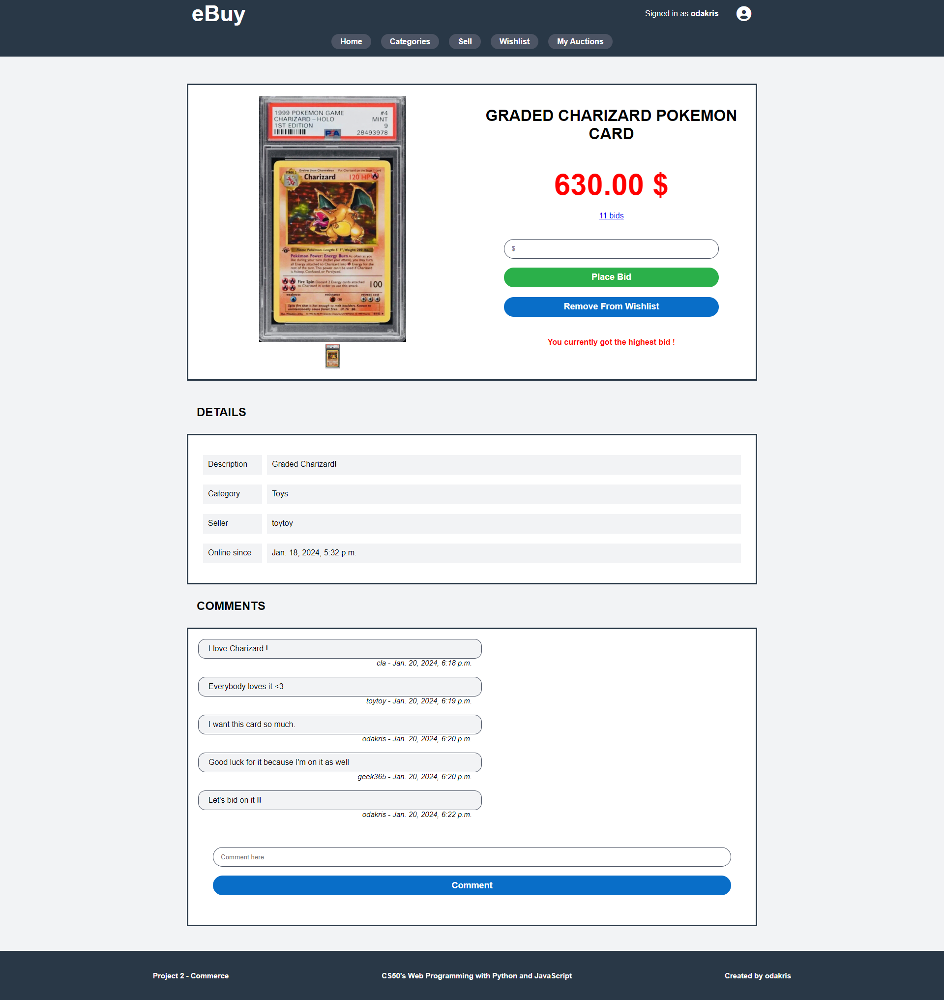
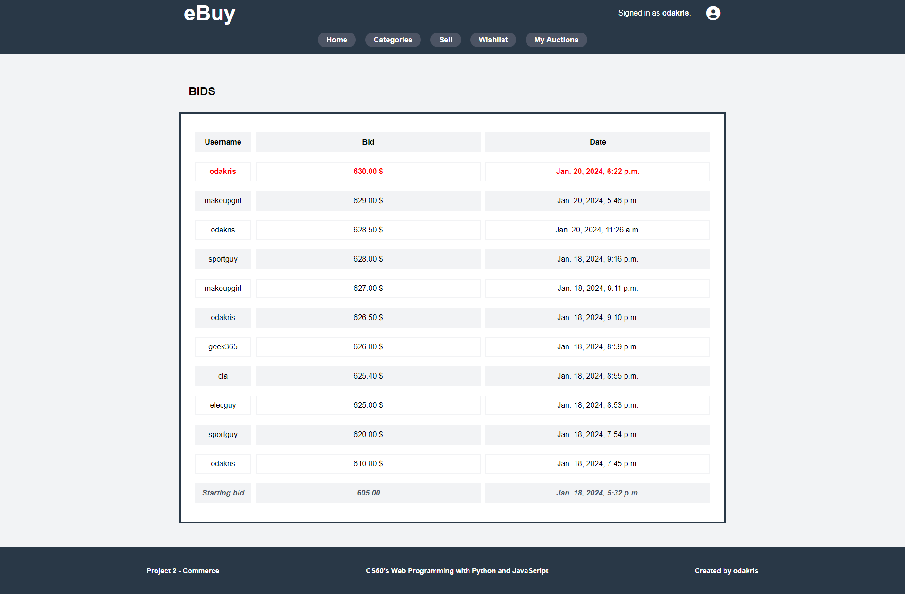
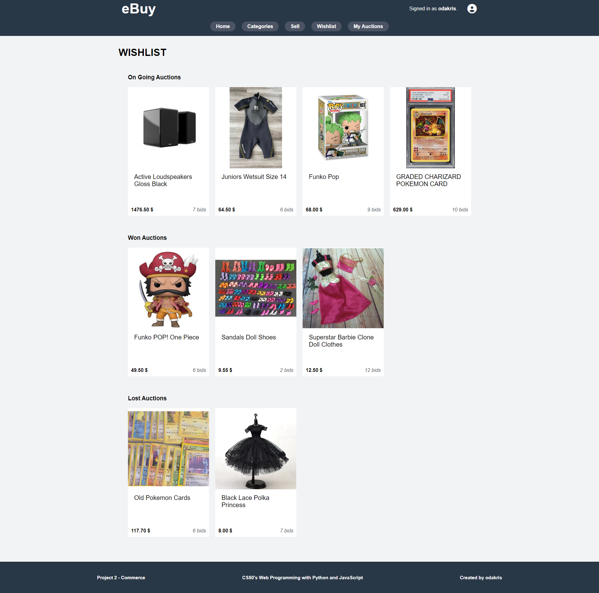
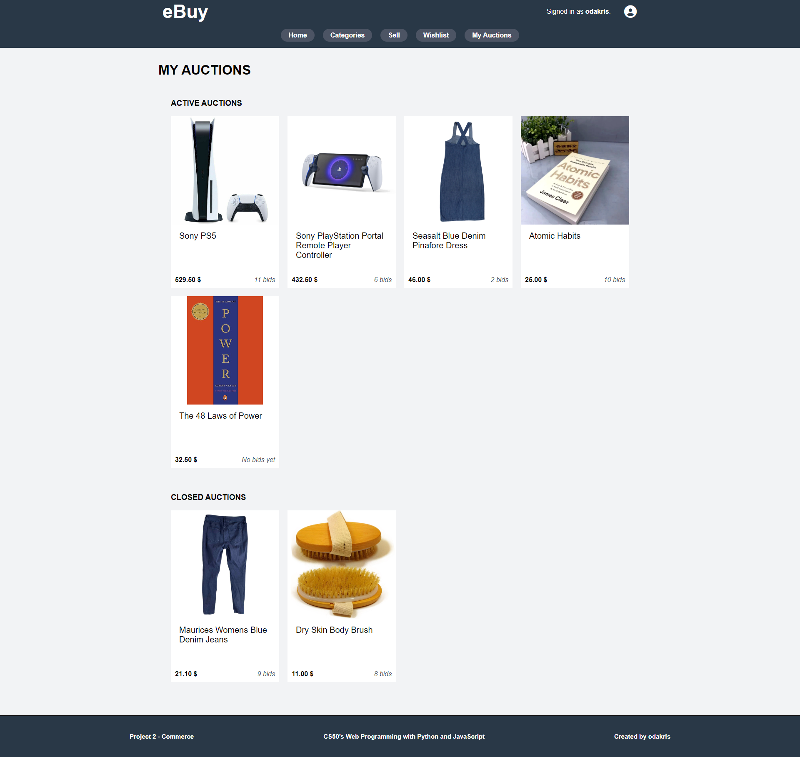
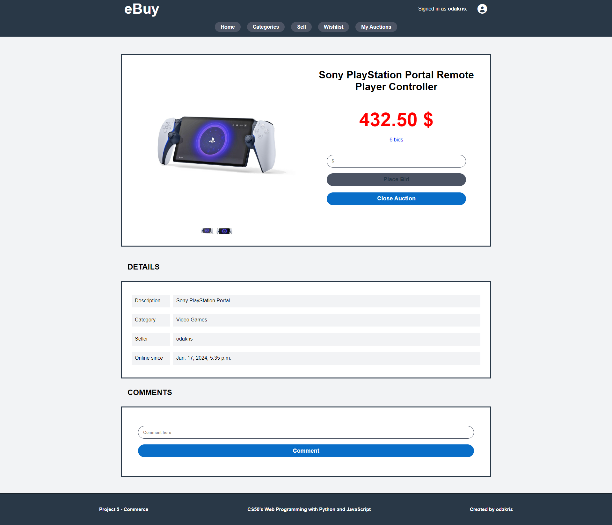
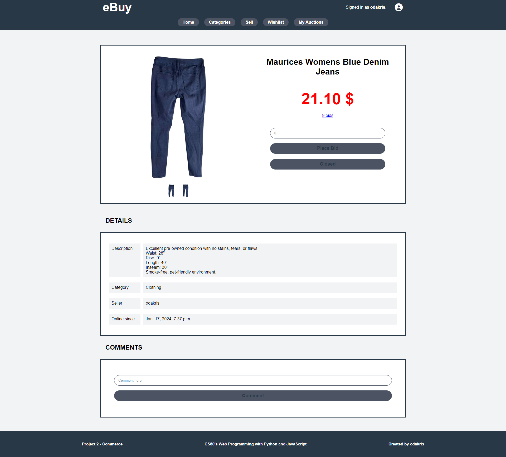

# CS50w - Commerce


Video demo of **[Commerce](https://www.youtube.com/watch?v=WMQmilydvbs)**

## Description

This is a eBay-like e-commerce auction site that will allow users to post auction listings, place bids on listings, comment on those listings, and add listings to a “watchlist”. Instructions for completing this project can be found at https://cs50.harvard.edu/web/2020/projects/2/commerce/

This project is part of the **[CS50’s Web Programming with Python and JavaScript](https://cs50.harvard.edu/web/2020/)**.

### HOMEPAGE

This is the index/homepage. Banners redirect user to the specific category by clicking on it.
Newest and most popular items (based on bids count) are displayed on mainpage.

<p align="center">
  
</p>

### Categories

It is possible to apply category filter by selected wanted category.

<p align="center">
  
</p>

### SELL

On this page, user can sell his items by providing a title, a category, a brief description, starting price and some pictures. It is possible to add severals pictures.

<p align="center">
  
</p>

### Auction

This is the main page for any listed auction. User can see pictures by hovering mouse on pictures, bid, add/remove to wishlist, view details about the auction and comment.

Message is displayed if user bid, if got the highest bid and when item is added/removed from wishlist.

<p align="center">
  
</p>

### Bids

<p align="center">
  
</p>

### Wishlist

This is where wishlisted items will be display. There is three sections as "on going", "won" and "lost".

<p align="center">
  
</p>

### My Auctions

This is where items posted by the user will be display. At any time, user can decide to close his auction. There is two section "active" and "closed".

<p align="center">
  
</p>

<p align="center">
  
  
</p>

## Instructions

Install [Python](https://www.python.org/downloads/), then you can install [Django](https://docs.djangoproject.com/en/4.2/topics/install/) :

```
python -m pip install Django
```

Clone this repository and launch Wiki web app with :

```
python manage.py runserver
```

## Credit

**[CS50w](https://pll.harvard.edu/course/cs50s-web-programming-python-and-javascript)**<br>
**[David J. Malan](https://cs.harvard.edu/malan/)**<br>
**[Brian Yu](https://brianyu.me/)**<br>
**[Doug Lloyd](https://hls.harvard.edu/doug-lloyd/)**<br>
